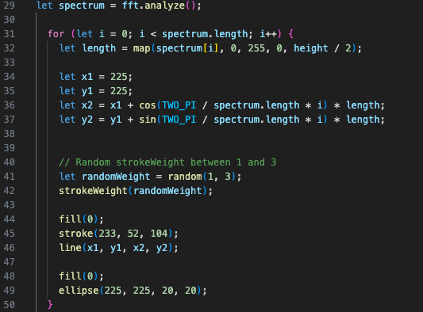

# 9103_Design-Programming_Tut2_GroupB_Shirley-Zhang_fzha0992

## Creative coding major project

### Individual Task

#### Audio: Use the level or frequency content of an audio track to animate your work.

- According to the graphics completed by our group, the graphics are composed of many circles of different sizes, so my initial idea was to add lines animation effect to the center of the circles or dots. The length of the lines are determined by the length of the preloaded mp3 file's spectrum. But the effect is not very ideal, the picture looks messy.

- 

[A link to an example code]()

